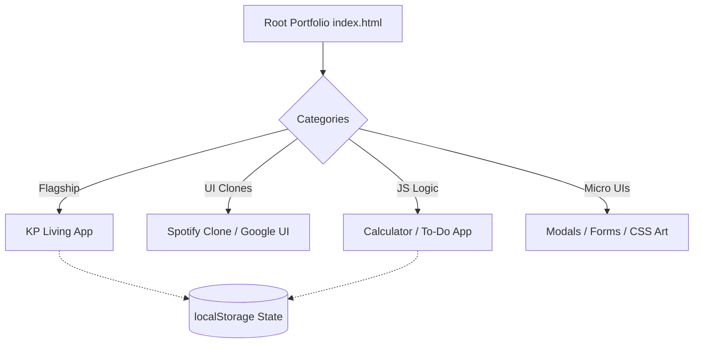

# 🚀 Kaushal Prajapati — Web Development Journey

<div align="center">
  <h3>Building modern web experiences, from foundational concepts to flagship applications.</h3>
  <p>
    <a href="https://hellokaushal.dev" target="_blank">
      
    </a>
    <a href="https://github.com/KaushalxPrajapati/web-dev-journey" target="_blank">
      
    </a>
    
  </p>
</div>

---

## 📖 Overview

Welcome to my **Web Development Journey** repository!

This project is a comprehensive, chronological archive of my transition from foundational HTML/CSS to advanced frontend architectures and backend explorations. Instead of scattering my progress across dozens of micro-repositories, I have consolidated my entire learning progression here.

The repository serves two main purposes:

1. **The Root Portfolio:** The main directory houses a fully responsive, custom-built, premium portfolio website that acts as a sleek directory for all my work.
2. **The Archive:** Categorized subdirectories containing UI clones, JavaScript logic challenges, backend scripts, and full flagship projects.

---

## ✨ Project Previews


## 🛠️ Tech Stack & Skills

- **Frontend Core:** HTML5, CSS3, Vanilla JavaScript (ES6+)
- **State & Data:** DOM Manipulation, `localStorage`, JSON
- **Backend & DB (Exploration):** Node.js, Express.js, MySQL
- **Tooling:** Git, GitHub Actions (CI/CD workflows), VS Code Live Server

---

## 🌟 Key Features & Flagship Project

### **KP Living — E-Commerce Furniture Store**

Located in [`/02-projects/html-css-js/kp-living`](./02-projects/html-css-js/kp-living/).

This is the flagship project of the repository—a complete static e-commerce platform built strictly without heavy frameworks.

- **Multi-page Architecture:** 7 connected views including Shop, Cart, and Checkout.
- **Dynamic State:** Persistent shopping cart powered by JavaScript `localStorage`.
- **Advanced Filtering:** Multi-criteria product sorting and filtering system.
- **Complex Validation:** Dynamic pricing calculations, GST, and Web3Forms integration for checkout.

---

## 📂 Folder Structure

```text
web-dev-journey/
│
├── index.html            # Main portfolio entry point
├── style.css             # Premium custom CSS system
├── script.js             # Portfolio interactivity & animations
│
├── 01-foundation/        # Early HTML/CSS concepts & assignments
├── 02-projects/          # The core archive
│   ├── html-css/         # UI clones (Spotify, W3Schools)
│   ├── html-css-js/      # Logic heavy apps (KP Living, Simon Says, Calculator)
│   └── experimental/     # JS Logic challenges, mini-games, and array method scripts
├── 03-backend/           # Node.js & Express REST APIs
└── 04-database/          # MySQL integrations and Mock Data generators
```

---

## ⚙️ Architecture Flow



---

## 💻 Installation & Local Setup

Because the majority of this repository is built utilizing Vanilla web technologies, there is **no complex build step** required.

1. **Clone the repository:**
    ```bash
    git clone https://github.com/KaushalxPrajapati/web-dev-journey.git
    ```
2. **Open the directory** in your favorite IDE (e.g., VS Code).
3. **Launch the app:**
    - Use the [Live Server](https://marketplace.visualstudio.com/items?itemName=ritwickdey.LiveServer) extension on the root `index.html` file.
    - Navigate through the UI to access any sub-project.
4. **Backend Exploration:**
    - For backend projects in `/03-backend`, navigate to the specific folder and run `npm install` followed by `node app.js` (or the respective script name).

---

## 🧠 What I Learned & Challenges Solved

- **DOM Performance & State:** Managed complex state manually across multiple pages using `localStorage` before relying on heavy frameworks like React.
- **CSS Architecture:** Built a reusable, modular CSS variable system from scratch, allowing for dynamic premium theming without a framework like Tailwind.
- **Responsive Engineering:** Solved intricate layout challenges using modern CSS Grid and Flexbox to ensure pixel-perfect rendering from mobile to displays.
- **Encoding & Data Integrity:** Handled and resolved character encoding bugs (UTF-8 vs Windows-1252) via automated Node.js scripts during large-scale file refactoring operations.

---

## 🚀 Future Improvements

- [ ] Implement a full dark/light mode toggle for the root portfolio.
- [ ] Migrate the flagship `KP Living` project to React to demonstrate modern framework proficiency.
- [ ] Add actual screenshot assets to the repository for this README.
- [ ] Set up an automated testing suite for the vanilla JS logic.

---

## 🤝 Contributing

This is a personal learning repository, but suggestions, code reviews, and feedback from senior developers or recruiters are always welcome! Feel free to open an issue or submit a pull request if you spot a bug or an optimization opportunity.

---

## 👨‍💻 Author

**Kaushal Prajapati**

- 🌐 **Portfolio:** [hellokaushal.dev](https://hellokaushal.dev)
- 🐙 **GitHub:** [@KaushalxPrajapati](https://github.com/KaushalxPrajapati)

---

<div align="center">
  <i>Crafted with passion and continuous learning.</i>
</div>
