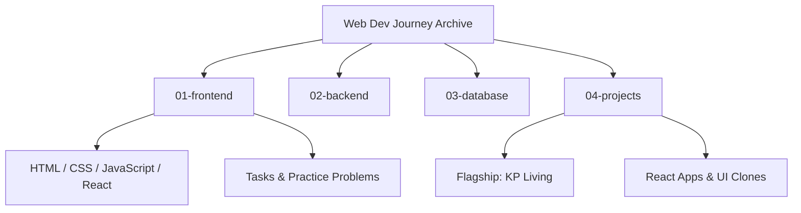

# 🚀 Kaushal Prajapati — Web Development Journey

<div align="center">
  <h3>Building modern web experiences, from foundational concepts to flagship applications.</h3>
  <p>
    <a href="https://hellokaushal.dev" target="_blank">
      
    </a>
    <a href="https://github.com/KaushalxPrajapati/web-dev-journey" target="_blank">
      
    </a>
    
  </p>
</div>

---

## 📖 Overview

Welcome to my **Web Development Journey** repository!

This repository serves as a **comprehensive, structured learning archive and codebase** documenting my progression across full-stack web development—from foundational HTML/CSS and modern JavaScript challenges to backend REST APIs, database management, and complete flagship projects.

> 🌐 **Looking for my portfolio?** My personal portfolio and project showcase is maintained in a dedicated repository and is live at [**hellokaushal.dev**](https://hellokaushal.dev).

---

## ✨ Project Previews

## 🛠️ Tech Stack & Skills

- **Frontend Core:** HTML5, CSS3, Vanilla JavaScript (ES6+)
- **State & Data:** DOM Manipulation, `localStorage`, JSON
- **Backend & DB (Exploration):** Node.js, Express.js, MySQL
- **Tooling:** Git, GitHub Actions (CI/CD workflows), VS Code Live Server

---

## 🌟 Key Features & Flagship Project

### **KP Living — E-Commerce Furniture Store**

Located in [`/04-projects/02-javascript-apps/kp-living`](./04-projects/02-javascript-apps/kp-living/).

This is the flagship project of the repository—a complete static e-commerce platform built strictly without heavy frameworks.

- **Multi-page Architecture:** 7 connected views including Shop, Cart, and Checkout.
- **Dynamic State:** Persistent shopping cart powered by JavaScript `localStorage`.
- **Advanced Filtering:** Multi-criteria product sorting and filtering system.
- **Complex Validation:** Dynamic pricing calculations, GST, and Web3Forms integration for checkout.

---

## 📂 Folder Structure

```text
web-dev-journey/
│
├── 01-frontend/           # HTML, CSS, JavaScript (tasks & practice problems), React
├── 02-backend/            # Node.js & Express REST APIs
├── 03-database/           # SQL / MySQL integrations and mock data
├── 04-projects/           # Static websites, JS apps, React apps, Bootstrap, Tailwind, Full Stack
├── assets/                # Common media, branding, and icons
└── notes/                 # Quick reference sheets and revision notes
```

---

## ⚙️ Architecture Flow


```mermaid
graph TD;
    A[Web Dev Journey Archive] --> B[01-frontend];
    A --> C[02-backend];
    A --> D[03-database];
    A --> E[04-projects];

    B --> B1[HTML / CSS / JavaScript / React];
    B --> B2[Tasks & Practice Problems];
    E --> E1[Flagship: KP Living];
    E --> E2[React Apps & UI Clones];
```

---

## 💻 Installation & Local Setup

Because the majority of this repository is built utilizing Vanilla web technologies alongside focused node/react modules, exploring projects is straightforward:

1. **Clone the repository:**
    ```bash
    git clone https://github.com/KaushalxPrajapati/web-dev-journey.git
    ```
2. **Open the directory** in your favorite IDE (e.g., VS Code or Antigravity IDE).
3. **Explore Frontend Projects & Practice:**
    - Navigate to any project or practice folder (e.g., in `04-projects/` or `01-frontend/`).
    - Open with the [Live Server](https://marketplace.visualstudio.com/items?itemName=ritwickdey.LiveServer) extension on its `index.html` file.
4. **Backend & React Apps:**
    - For backend modules in `02-backend` or React apps in `04-projects/03-react-apps`, navigate to the specific project folder, run `npm install`, and start the project (`npm run dev` or `node app.js`).

---

## 🧠 What I Learned & Challenges Solved

- **DOM Performance & State:** Managed complex state manually across multiple pages using `localStorage` before relying on heavy frameworks like React.
- **CSS Architecture:** Built a reusable, modular CSS variable system from scratch, allowing for dynamic premium theming without a framework like Tailwind.
- **Responsive Engineering:** Solved intricate layout challenges using modern CSS Grid and Flexbox to ensure pixel-perfect rendering from mobile to displays.
- **Encoding & Data Integrity:** Handled and resolved character encoding bugs (UTF-8 vs Windows-1252) via automated Node.js scripts during large-scale file refactoring operations.

---

## 🚀 Future Improvements

- [ ] Migrate the flagship `KP Living` project to React to demonstrate modern framework proficiency.
- [ ] Add actual screenshot assets to the repository for this README.
- [ ] Set up automated testing suites for the vanilla JS logic.
- [ ] Continue expanding backend REST APIs and database integration modules.

---

## 🤝 Contributing

This is a personal learning repository, but suggestions, code reviews, and feedback from senior developers or recruiters are always welcome! Feel free to open an issue or submit a pull request if you spot a bug or an optimization opportunity.

---

## 👨‍💻 Author

**Kaushal Prajapati**

- 🌐 **Portfolio:** [hellokaushal.dev](https://hellokaushal.dev)
- 🐙 **GitHub:** [@KaushalxPrajapati](https://github.com/KaushalxPrajapati)

---

<div align="center">
  <i>Crafted with passion and continuous learning.</i>
</div>
